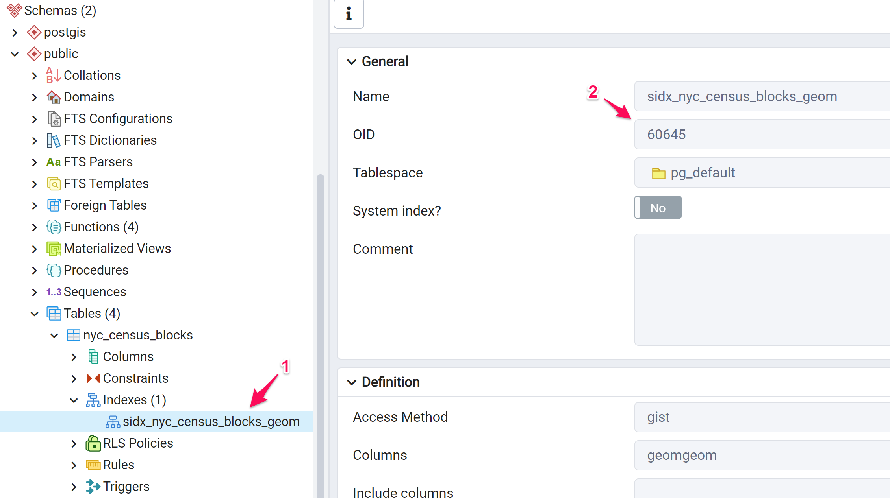

# R-Tree

## Gevel

[Gevel](http://www.sai.msu.su/~megera/wiki/Gevel "Gevel contrib module") contrib module provides several functions useful for analyzing GiST indexes.

### Install Instructions

---

You need to have an installation of PostgreSQL of version **13** in order to use this build of gevel extension.

You will need to place the files that are located in **gevel_ext** folder into respective folders inside PostgreSQL folder.

- `gevel_ext.dll` - Copy it to `C:\Program Files\PostgreSQL\13\lib\`.
- `gevel_ext.sql` - Copy it to `C:\Program Files\PostgreSQL\13\share\extension\` and rename to gevel_ext--1.0.sql.
- `gevel_ext.control` - Copy it to `C:\Program Files\PostgreSQL\13\share\extension\`.

### Usage

---

#### Creating Extension

First, you need to install module into database that contains index you want to analyze. Use this command to create extension:

```sql
DROP EXTENSION IF EXISTS gevel_ext CASCADE;
CREATE EXTENSION gevel_ext;
```

#### Getting Index OID

After this you should be able to use functions from the extension - functions doesn't accept name of the index but its OID. This has advantage that OID identifies index without any ambiguity and doesn't require specifying schemas and such.

You can find OID of index for example through `pgadmin` by right clicking desired index and going into properties. However, it has also disadvantage that OID changes everytime index is recreated - which will be probably done if you are analyzing it.



In that case, it might be more convenient to get OID with SQL, which can be then used when executing function (substitute for `*index_name*` name of your index):

```sql
SELECT CAST(c.oid AS INTEGER) FROM pg_class c, pg_index i 
WHERE c.oid = i.indexrelid and c.relname = '*index_name*' LIMIT 1
```

You can also use a query that I have provided in the queries folder to list all indices with respective OID.

#### Using module

Having OID of index, you can start using the extension. It supports 3 functions:

- **gist_stat** : Prints statistics about the index, such as it's size, number of leaf nodes, etc.
- **gist_tree**(*index_name*, *max_level*) : Prints index as tree of internal nodes with number of tuples in each page and other data. The depth of tree can be controlled with the second argument.
- **gist_print**(*index_name*) : Prints actual tuples that create index. For this to work, objects in index must have textual representation (they have to be printable).

#### Examples

Print index as tree with depth 1.

```sql
SELECT gist_tree(
    (
        SELECT CAST(c.oid AS INTEGER)
        FROM pg_class c, pg_index i 
        WHERE c.oid = i.indexrelid
        AND c.relname = 'nyc_streets_geom_idx'
        LIMIT 1
    )
            , 1);
```

## Psycopg

[Psycopg](https://www.psycopg.org/docs/index.html "Psycopg – PostgreSQL database adapter for Python") is a PostgreSQL database adapter for the Python programming language.

```bash
pip install psycopg2-binary
```
